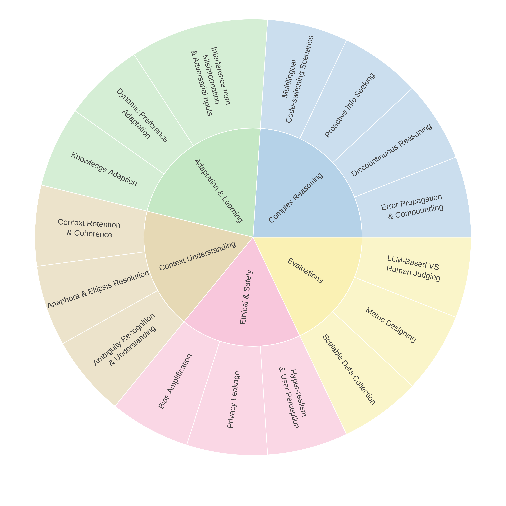

# Awesome-Multi-Turn-LLMs

A curated list of **Papers**, **Datasets** and **Code Repositories** for ***Multi-turn Interactions with Large Language Models***. This repository compiles a majority of research works in the multi-turn LLM field, though it may not be fully exhaustive.

Our detailed survey of multi-turn LLMs, covering task types, improvement methods, and open challenges, is available here: [**Beyond Single-Turn: A Survey on Multi-Turn Interactions with Large Language Models**](https://arxiv.org/abs/2504.04717).
> If you notice any missing research works or spot inaccuracies, feel free to reach out or open an issue. We also welcome submissions of multi-turn related work from everyone!

Audio demo: [Play the survey audio](https://raw.githubusercontent.com/yubol-bobo/Awesome-Multi-Turn-LLMs/main/audio/Multi_Turn_LLM_Survey.wav)

## Table of Contents
- [Awesome-Multi-Turn-LLMs](#awesome-multi-turn-llms)
  - [Table of Contents](#table-of-contents)
  - [Keywords Convention](#keywords-convention)
  - [Multi-Turn LLM Tasks](#multi-turn-llm-tasks)
    - [Instruction Following Tasks](#instruction-following-tasks)
      - [Instruction Following in General (Mixed)](#instruction-following-in-general-mixed)
      - [Instruction Following in Math](#instruction-following-in-math)
      - [Instruction Following in Coding](#instruction-following-in-coding)
      - [Instruction Following in Discussion](#instruction-following-in-discussion)
    - [Conversational Engagement Tasks](#conversational-engagement-tasks)
      - [Conversational Engagement in General (Mixed)](#conversational-engagement-in-general-mixed)
      - [Conversational Engagement in Roleplay](#conversational-engagement-in-roleplay)
      - [Conversational Engagement in Healthcare](#conversational-engagement-in-healthcare)
      - [Conversational Engagement in Education](#conversational-engagement-in-education)
      - [Conversational Engagement in Jailbreak](#conversational-engagement-in-jailbreak)
  - [Improvement Methods](#improvement-methods)
    - [Multi-Round Communication](#multi-round-communication)
      - [In-Context Learning](#in-context-learning)
      - [Supervised Fine-Tuning](#supervised-fine-tuning)
      - [Reinforcement Learning](#reinforcement-learning)
      - [New Architectures](#new-architectures)
    - [Agent-Based Approaches](#agent-based-approaches)
      - [Single-Agent Approaches](#single-agent-approaches)
      - [Multi-Agent Approaches](#multi-agent-approaches)
    - [External Information Integration](#external-information-integration)
      - [Memory-Augmented Methods](#memory-augmented-methods)
      - [Retrieval-Augmented Generation](#retrieval-augmented-generation)
      - [Knowledge Graph Integration](#knowledge-graph-integration)
  - [Open Challenges](#open-challenges)
  - [Star History](#star-history)

### Keywords Convention

 New dataset created in the work.

 Benchmark proposed in the work.

 SFT used in the work.

 Reinforcement Learning used in the work.

 Other improvement method(s) used in the work.

## Multi-Turn LLM Tasks

### Instruction Following Tasks

#### Instruction Following in General (Mixed)

- Judging llm-as-a-judge with mt-bench and chatbot arena [[NeurIPS 2023](http://arxiv.org/abs/2306.05685)] [[GitHub](https://github.com/lm-sys/fastchat)]
                     
- Bigbench: Towards an industry standard benchmark for big data analytics [[SIGMOD 2013](https://doi.org/10.1145/2463676.2463712)]
                  
- CommonsenseQA: A Question Answering Challenge Targeting Commonsense Knowledge [[arXiv](http://arxiv.org/abs/1811.00937)]
- Measuring Massive Multitask Language Understanding [[ICLR 2021](https://openreview.net/pdf?id=d7KBjmI3GmQ)]
- Training verifiers to solve math word problems [[arXiv](http://arxiv.org/abs/2110.14168)]
- AlpacaEval: An Automatic Evaluator of Instruction-following Models [[GitHub](https://github.com/tatsu-lab/alpaca_eval)]
                  
- Parrot: Enhancing multi-turn instruction following for large language models [[ACL 2024](https://doi.org/10.18653/v1/2024.acl-long.525)]
- Mt-bench-101: A fine-grained benchmark for evaluating large language models in multi-turn dialogues [[ACL 2024](https://doi.org/10.18653/v1/2024.acl-long.401)] [[GitHub](https://github.com/mtbench101/mt-bench-101)]
                     
- MT-Eval: A Multi-Turn Capabilities Evaluation Benchmark for Large Language Models [[EMNLP 2024](https://doi.org/10.18653/v1/2024.emnlp-main.1124)] [[GitHub](https://github.com/KwanWaiChung/MT-Eval)]
                   
- M2lingual: Enhancing multilingual, multi-turn instruction alignment in large language models [[NAACL 2025](https://doi.org/10.18653/v1/2025.naacl-long.489)] [[Hugging Face](https://huggingface.co/datasets/ServiceNow-AI/M2Lingual)]
                   
- Multi-IF: Benchmarking LLMs on Multi-Turn and Multilingual Instructions Following [[arXiv](http://arxiv.org/abs/2410.15553)] [[GitHub](https://github.com/facebookresearch/Multi-IF)] [[Hugging Face](https://huggingface.co/datasets/facebook/Multi-IF)]
                   
- Instruction-following evaluation for large language models [[arXiv](http://arxiv.org/abs/2311.07911)]
- FairMT-Bench: Benchmarking Fairness for Multi-turn Dialogue in Conversational LLMs [[ICLR 2025](http://arxiv.org/abs/2410.19317)] [[GitHub](https://github.com/FanZT6/FairMT-bench)]
                   
- Fb-bench: A fine-grained multi-task benchmark for evaluating llms’ responsiveness to human feedback [[EMNLP 2025](http://arxiv.org/abs/2410.09412)] [[GitHub](https://github.com/PKU-Baichuan-MLSystemLab/FB-Bench)]
                   
- Firm or Fickle' Evaluating Large Language Models Consistency in Sequential Interactions [[Findings of ACL 2025](https://doi.org/10.18653/v1/2025.findings-acl.347)] [[GitHub](https://github.com/yubol-bobo/Multi_Turn_PWC)]
                   
- AQA-Bench: An Interactive Benchmark for Evaluating LLMs' Sequential Reasoning Ability [[arXiv](https://arxiv.org/abs/2402.09404)] [[GitHub](https://github.com/UCSC-VLAA/AQA-Bench)]
                  
- Wilt: A multi-turn, memorization-robust inductive logic benchmark for llms [[arXiv](http://arxiv.org/abs/2410.10998)] [[GitHub](https://github.com/riotgames/wilt)]
                  
- WEBLINX: real-world website navigation with multi-turn dialogue [[ICML 2024](http://arxiv.org/abs/2402.05930)]
- Can Language Models Follow Multiple Turns of Entangled Instructions' [[Findings of EMNLP 2025](https://doi.org/10.18653/v1/2025.findings-emnlp.1387)]
- SysBench: Can Large Language Models Follow System Messages? [[ICLR 2025](https://openreview.net/forum?id=KZWaxtzIRx)] [[GitHub](https://github.com/pku-baichuan-mlsystemlab/sysbench)]
                   
- SAPIENT: Mastering Multi-turn Conversational Recommendation with Strategic Planning and Monte Carlo Tree Search [[NAACL 2025](http://arxiv.org/abs/2410.09580)]
- Towards empathetic conversational recommender systems [[Preprint](https://doi.org/10.1145/3640457.3688133)]
- Clarify When Necessary: Resolving Ambiguity Through Interaction with LMs [[Findings of NAACL 2025](https://doi.org/10.18653/v1/2025.findings-naacl.306)]
- Teaching Language Models To Gather Information Proactively [[Findings of EMNLP 2025](https://doi.org/10.18653/v1/2025.findings-emnlp.843)]
- StructFlowBench: A Structured Flow Benchmark for Multi-turn Instruction Following [[Findings of ACL 2025](https://doi.org/10.18653/v1/2025.findings-acl.486)]
                   
- TRUEBench: Can LLM Response Meet Real-world Constraints as Productivity Assistant' [[Findings of EMNLP 2025](https://doi.org/10.18653/v1/2025.findings-emnlp.776)]
                   
- One Battle After Another: Probing LLMs' Limits on Multi-Turn Instruction Following with a Benchmark Evolving Framework [[arXiv](https://doi.org/10.48550/arxiv.2511.03508)]
                   
- TURNWISE: The Gap between Single- and Multi-turn Language Model Capabilities [[arXiv](http://arxiv.org/abs/2603.16759)]
- IHEval: Evaluating Language Models on Following the Instruction Hierarchy [[NAACL 2025](https://doi.org/10.18653/v1/2025.naacl-long.425)]
- Another Turn, Better Output': A Turn-Wise Analysis of Iterative LLM Prompting [[arXiv](http://arxiv.org/abs/2509.06770)]

#### Instruction Following in Math

- Chain-of-thought prompting elicits reasoning in large language models [[NeurIPS 2022](https://doi.org/10.52202/068431-1800)]
- MathChat: Benchmarking Mathematical Reasoning and Instruction Following in Multi-Turn Interactions [[arXiv](http://arxiv.org/abs/2405.19444)] [[GitHub](https://github.com/Zhenwen-NLP/MathChat)]
                    
- Mathematical discoveries from program search with large language models [[Preprint](https://doi.org/10.1038/s41586-023-06924-6)]
- Let's verify step by step [[ICLR 2023](http://arxiv.org/abs/2305.20050)]
- MathChat: Converse to Tackle Challenging Math Problems with LLM Agents [[arXiv](http://arxiv.org/abs/2306.01337)]
                  
- Zero-Shot Mathematical Problem Solving with Large Language Models via Multi-Agent Conversation Programming [[AAAI Workshop 2024](https://openreview.net/forum?id=69NtdESyvu)]
- Building Math Agents with Multi-Turn Iterative Preference Learning [[ICLR 2025](http://arxiv.org/abs/2409.02392)]
                  
- MINT: Evaluating LLMs in Multi-turn Interaction with Tools and Language Feedback [[ICLR 2024](http://arxiv.org/abs/2309.10691)] [[GitHub](https://github.com/xingyaoww/mint-bench)]
                     
- MathDial: A Dialogue Tutoring Dataset with Rich Pedagogical Properties Grounded in Math Reasoning Problems [[Findings of EMNLP 2023](https://doi.org/10.18653/v1/2023.findings-emnlp.372)] [[GitHub](https://github.com/eth-nlped/mathdial)] [[Hugging Face](https://huggingface.co/datasets/eth-nlped/mathdial)]
                   
- SBSC: Step-by-Step Coding for Improving Mathematical Olympiad Performance [[arXiv](http://arxiv.org/abs/2502.16666)]
- From Solver to Tutor: Evaluating the Pedagogical Intelligence of LLMs with KMP-Bench [[AAAI 2026](https://doi.org/10.1609/aaai.v40i39.40578)]
                   
- Unifying AI Tutor Evaluation: An Evaluation Taxonomy for Pedagogical Ability Assessment of LLM-Powered AI Tutors [[NAACL 2025](https://doi.org/10.18653/v1/2025.naacl-long.57)]
- Intent Matters: Enhancing AI Tutoring with Fine-Grained Pedagogical Intent Annotation [[arXiv](http://arxiv.org/abs/2506.07626)]
- Beyond Final Answers: Evaluating Large Language Models for Math Tutoring [[Preprint](https://doi.org/10.1007/978-3-031-98414-3_23)]

#### Instruction Following in Coding

- Debug like a Human: A Large Language Model Debugger via Verifying Runtime Execution Step by Step [[Findings of ACL 2024](https://doi.org/10.18653/v1/2024.findings-acl.49)] [[GitHub](https://github.com/FloridSleeves/LLMDebugger)]
                  
- Steering Large Language Models between Code Execution and Textual Reasoning [[ICLR 2025](http://arxiv.org/abs/2410.03524)] [[GitHub](https://yongchao98.github.io/CodeSteer/)] [[Hugging Face](https://huggingface.co/yongchao98/CodeSteer-v1)]
                  
- From Code to Correctness: Closing the Last Mile of Code Generation with Hierarchical Debugging [[arXiv](http://arxiv.org/abs/2410.01215)] [[GitHub](https://github.com/YerbaPage/MGDebugger)]
- Intercode: Standardizing and benchmarking interactive coding with execution feedback [[NeurIPS 2023](http://arxiv.org/abs/2306.14898)] [[GitHub](https://intercode-benchmark.github.io/)]
                    
- What Makes Large Language Models Reason in (Multi-Turn) Code Generation' [[ICLR 2025](http://arxiv.org/abs/2410.08105)]
                  
- Spider: A Large-Scale Human-Labeled Dataset for Complex and Cross-Domain Semantic Parsing and Text-to-SQL Task [[EMNLP 2018](https://doi.org/10.18653/v1/d18-1425)]
                  
- Program Synthesis with Large Language Models [[arXiv](http://arxiv.org/abs/2108.07732)]
- Nl2bash: A corpus and semantic parser for natural language interface to the linux operating system [[arXiv](http://arxiv.org/abs/1802.08979)]
                  
- Competition-level code generation with alphacode [[Preprint](https://doi.org/10.1126/science.abq1158)]
- TACO: Topics in Algorithmic COde generation dataset [[arXiv](http://arxiv.org/abs/2312.14852)]
                  
- PyBench: Evaluating LLM Agent on various real-world coding tasks [[arXiv](http://arxiv.org/abs/2407.16732v2)] [[GitHub](https://github.com/Mercury7353/PyBench)] [[Hugging Face](https://huggingface.co/datasets/Mercury7353/PyInstruct)]
                   
- CodeGen: An Open Large Language Model for Code with Multi-Turn Program Synthesis [[ICLR 2023](http://arxiv.org/abs/2203.13474)] [[GitHub](https://github.com/salesforce/CodeGen/tree/main)] [[Hugging Face](https://huggingface.co/models?search=salesforce+codegen)]
                    
- Codegen2: Lessons for training llms on programming and natural languages [[arXiv](http://arxiv.org/abs/2305.02309)] [[GitHub](https://github.com/salesforce/CodeGen/tree/main)] [[Hugging Face](https://huggingface.co/models?search=salesforce+codegen)]
                  
- CodeSteer: Symbolic-Augmented Language Models via Code/Text Guidance [[ICML 2025](http://arxiv.org/abs/2502.04350)] [[GitHub](https://github.com/yongchao98/CodeSteer-v1.0?tab=readme-ov-file)] [[Hugging Face](https://huggingface.co/yongchao98/CodeSteer-v1)]
                    
- Opencodeinterpreter: Integrating code generation with execution and refinement [[Findings of ACL 2024](https://doi.org/10.18653/v1/2024.findings-acl.762)] [[GitHub](https://opencodeinterpreter.github.io/)] [[Hugging Face](https://huggingface.co/papers/2402.14658)]
                   
- Executable code actions elicit better llm agents [[ICML 2024](http://arxiv.org/abs/2402.01030)] [[GitHub](https://github.com/xingyaoww/code-act)] [[Hugging Face](https://huggingface.co/datasets/xingyaoww/code-act)]
                   
- Evaluating and Enhancing LLMs for Multi-turn Text-to-SQL with Multiple Question Types [[arXiv](http://arxiv.org/abs/2412.17867)] [[GitHub](https://github.com/mcxiaoxiao/MMSQL)]
                    
- EHRAgent: Code Empowers Large Language Models for Few-shot Complex Tabular Reasoning on Electronic Health Records [[EMNLP 2024](https://doi.org/10.18653/v1/2024.emnlp-main.1245)] [[GitHub](https://github.com/wshi83/EhrAgent)]
                   
- Instruct, Not Assist: LLM-based Multi-Turn Planning and Hierarchical Questioning for Socratic Code Debugging [[Findings of EMNLP 2024](https://doi.org/10.18653/v1/2024.findings-emnlp.553)] [[GitHub](https://github.com/agarwalishika/TreeInstruct)]
- ClarifyGPT: Empowering LLM-based Code Generation with Intention Clarification [[arXiv](http://arxiv.org/abs/2310.10996)]
- When Benchmarks Talk: Re-Evaluating Code LLMs with Interactive Feedback [[arXiv](http://arxiv.org/abs/2502.18413)]
                   
- CONVCODEWORLD: Benchmarking Conversational Code Generation in Reproducible Feedback Environments [[arXiv](http://arxiv.org/abs/2502.19852)]
                   
- CodeFlowBench: A Multi-turn, Iterative Benchmark for Complex Code Generation [[arXiv](https://arxiv.org/abs/2504.21751)]
                   
- A Hierarchical and Evolvable Benchmark for Fine-Grained Code Instruction Following with Multi-Turn Feedback [[arXiv](http://arxiv.org/abs/2507.00699)]
                   
- Benchmarking Correctness and Security in Multi-Turn Code Generation [[arXiv](http://arxiv.org/abs/2510.13859v1)]
                   
- Rethinking Text-to-SQL: Dynamic Multi-turn SQL Interaction for Real-world Database Exploration [[arXiv](http://arxiv.org/abs/2510.26495v2)]

#### Instruction Following in Discussion

- Judging llm-as-a-judge with mt-bench and chatbot arena [[NeurIPS 2023](http://arxiv.org/abs/2306.05685)] [[GitHub](https://github.com/lm-sys/fastchat)]
                     
- Preference Leakage: A Contamination Problem in LLM-as-a-judge [[ICLR 2026](http://arxiv.org/abs/2502.01534)]
- Does Context Matter' ContextualJudgeBench for Evaluating LLM-based Judges in Contextual Settings [[ACL 2025](https://doi.org/10.18653/v1/2025.acl-long.470)]
                  

### Conversational Engagement Tasks

#### Conversational Engagement in General (Mixed)

- Don't Forget Your ABC's: Evaluating the State-of-the-Art in Chat-Oriented Dialogue Systems [[ACL 2023](http://arxiv.org/abs/2212.09180)]
- BotChat: Evaluating LLMs' Capabilities of Having Multi-Turn Dialogues [[Findings of NAACL 2024](https://doi.org/10.18653/v1/2024.findings-naacl.201)]
- MultiChallenge: A Realistic Multi-Turn Conversation Evaluation Benchmark Challenging to Frontier LLMs [[Findings of ACL 2025](http://arxiv.org/abs/2501.17399)]
                  
- DialogBench: Evaluating LLMs as Human-like Dialogue Systems [[NAACL 2024](https://doi.org/10.18653/v1/2024.naacl-long.341)]
                   
- SimulatorArena: Are User Simulators Reliable Proxies for Multi-Turn Evaluation of AI Assistants' [[arXiv](http://arxiv.org/abs/2510.05444)]

#### Conversational Engagement in Roleplay

- A Persona-Based Neural Conversation Model [[ACL 2016](https://doi.org/10.18653/v1/p16-1094)]
- Exploring Personalized Neural Conversational Models [[Preprint](https://doi.org/10.24963/ijcai.2017/521)]
- Personalizing Dialogue Agents: I have a dog, do you have pets too' [[ACL 2018](https://doi.org/10.18653/v1/p18-1205)]
- The oscars of ai theater: A survey on role-playing with language models [[arXiv](http://arxiv.org/abs/2407.11484)]
- PersonaLLM: Investigating the Ability of Large Language Models to Express Personality Traits [[Findings of NAACL 2024](https://doi.org/10.18653/v1/2024.findings-naacl.229)] [[GitHub](https://github.com/hjian42/PersonaLLM)]
- Characterchat: Learning towards conversational ai with personalized social support [[arXiv](http://arxiv.org/abs/2308.10278)] [[GitHub](https://github.com/morecry/CharacterChat)]
                  
- Better Zero-Shot Reasoning with Role-Play Prompting [[NAACL 2024](https://doi.org/10.18653/v1/2024.naacl-long.228)] [[GitHub](https://github.com/NKU-HLT/Role-Play-Prompting)]
- Pippa: A partially synthetic conversational dataset [[arXiv](http://arxiv.org/abs/2308.05884)] [[Hugging Face](https://huggingface.co/datasets/PygmalionAI/PIPPA)]
                  
- Enhancing Chat Language Models by Scaling High-quality Instructional Conversations [[EMNLP 2023](https://doi.org/10.18653/v1/2023.emnlp-main.183)] [[GitHub](https://github.com/thunlp/UltraChat)]
                    
- PRODIGy: a PROfile-based DIalogue Generation dataset [[Findings of NAACL 2024](https://doi.org/10.18653/v1/2024.findings-naacl.222)] [[GitHub](https://github.com/LanD-FBK/prodigy-dataset)]
                   
- Chatharuhi: Reviving anime character in reality via large language model [[arXiv](http://arxiv.org/abs/2308.09597)] [[GitHub](https://github.com/LC1332/Chat-Haruhi-Suzumiya)]
                    
- CharacterGLM: Customizing Social Characters with Large Language Models [[EMNLP 2024](https://doi.org/10.18653/v1/2024.emnlp-industry.107)]
- RoleCraft-GLM: Advancing Personalized Role-Playing in Large Language Models [[Preprint](https://doi.org/10.18653/v1/2024.personalize-1.1)]
                   
- Large Language Models are Superpositions of All Characters: Attaining Arbitrary Role-play via Self-Alignment [[ACL 2024](https://doi.org/10.18653/v1/2024.acl-long.423)] [[GitHub](https://github.com/OFA-Sys/Ditto)]
                   
- Character-LLM: A Trainable Agent for Role-Playing [[EMNLP 2023](https://doi.org/10.18653/v1/2023.emnlp-main.814)] [[GitHub](https://github.com/choosewhatulike/trainable-agents)]
                   
- PersonaPKT: Building Personalized Dialogue Agents via Parameter-efficient Knowledge Transfer [[Preprint](https://doi.org/10.18653/v1/2023.sustainlp-1.21)]
                  
- LLMs + Persona-Plug = Personalized LLMs [[ACL 2025](https://doi.org/10.18653/v1/2025.acl-long.461)] [[Hugging Face](https://huggingface.co/papers/2409.11901)]
                  
- Neeko: Leveraging Dynamic LoRA for Efficient Multi-Character Role-Playing Agent [[EMNLP 2024](https://doi.org/10.18653/v1/2024.emnlp-main.697)] [[GitHub](https://github.com/weiyifan1023/Neeko)]
                   
- Instruct Once, Chat Consistently in Multiple Rounds: An Efficient Tuning Framework for Dialogue [[ACL 2024](https://doi.org/10.18653/v1/2024.acl-long.219)] [[GitHub](https://github.com/iwangjian/Midi-Tuning)]
                   
- Building Persona Consistent Dialogue Agents with Offline Reinforcement Learning [[EMNLP 2023](https://doi.org/10.18653/v1/2023.emnlp-main.110)]
                   
- Compress to Impress: Unleashing the Potential of Compressive Memory in Real-World Long-Term Conversations [[COLING 2025](http://arxiv.org/abs/2402.11975)]
- LaMP: When Large Language Models Meet Personalization [[ACL 2024](https://doi.org/10.18653/v1/2024.acl-long.399)] [[GitHub](https://lamp-benchmark.github.io/)]
                   
- CharacterEval: A Chinese Benchmark for Role-Playing Conversational Agent Evaluation [[ACL 2024](https://doi.org/10.18653/v1/2024.acl-long.638)] [[GitHub](https://github.com/morecry/CharacterEval)]
                   
- RoleEval: A Bilingual Role Evaluation Benchmark for Large Language Models [[arXiv](http://arxiv.org/abs/2312.16132)] [[GitHub](https://github.com/Magnetic2014/RoleEval)]
                   
- TimeChara: Evaluating Point-in-Time Character Hallucination of Role-Playing Large Language Models [[Findings of ACL 2024](https://doi.org/10.18653/v1/2024.findings-acl.197)] [[GitHub](https://github.com/ahnjaewoo/timechara)]
                   
- SimulBench: Evaluating Language Models with Creative Simulation Tasks [[Findings of NAACL 2025](https://doi.org/10.18653/v1/2025.findings-naacl.453)] [[GitHub](https://github.com/SimulBench/SimulBench)] [[Hugging Face](https://huggingface.co/datasets/SimulBench/SimulBench)]
                   
- InCharacter: Evaluating Personality Fidelity in Role-Playing Agents through Psychological Interviews [[ACL 2024](https://doi.org/10.18653/v1/2024.acl-long.102)] [[GitHub](https://incharacter.github.io/)]
                   
- SocialBench: Sociality Evaluation of Role-Playing Conversational Agents [[Findings of ACL 2024](https://doi.org/10.18653/v1/2024.findings-acl.125)] [[GitHub](https://github.com/X-PLUG/SocialBench)]
                   
- Evaluating Character Understanding of Large Language Models via Character Profiling from Fictional Works [[EMNLP 2024](https://doi.org/10.18653/v1/2024.emnlp-main.456)]
- RoleLLM: Benchmarking, Eliciting, and Enhancing Role-Playing Abilities of Large Language Models [[Findings of ACL 2024](https://doi.org/10.18653/v1/2024.findings-acl.878)]
                   
- RAIDEN Benchmark: Evaluating Role-playing Conversational Agents with Measurement-Driven Custom Dialogues [[COLING 2025](https://aclanthology.org/2025.coling-main.735/)]
                   
- RMTBench: Benchmarking LLMs Through Multi-Turn User-Centric Role-Playing [[Findings of EMNLP 2025](https://doi.org/10.18653/v1/2025.findings-emnlp.730)]
                   
- Evaluating LLM-Generated Versus Human-Authored Responses in Role-Play Dialogues [[arXiv](http://arxiv.org/abs/2509.17694)]
- A Personalized Conversational Benchmark: Towards Simulating Personalized Conversations [[arXiv](http://arxiv.org/abs/2505.14106)]
                   
- Know Me, Respond to Me: Benchmarking LLMs for Dynamic User Profiling and Personalized Responses at Scale [[arXiv](http://arxiv.org/abs/2504.14225v2)] [[GitHub](https://github.com/bowen-upenn/PersonaMem)]
                   
- CharacterBench: Benchmarking Character Customization of Large Language Models [[AAAI 2025](https://doi.org/10.1609/aaai.v39i24.34806)]
                   
- OpenCharacter: Training Customizable Role-Playing LLMs with Large-Scale Synthetic Personas [[arXiv](http://arxiv.org/abs/2501.15427)]
- Consistently Simulating Human Personas with Multi-Turn Reinforcement Learning [[arXiv](http://arxiv.org/abs/2511.00222)]
- RoleMRC: A Fine-Grained Composite Benchmark for Role-Playing and Instruction-Following [[arXiv](http://arxiv.org/abs/2502.11387)]
                   

#### Conversational Engagement in Healthcare

- Huatuo: Tuning llama model with chinese medical knowledge [[arXiv](http://arxiv.org/abs/2304.06975)]
- MING-MOE: Enhancing medical multi-task learning in large language models with sparse mixture of low-rank adapter experts [[arXiv](http://arxiv.org/abs/2404.09027)]
- Doctorglm: Fine-tuning your chinese doctor is not a herculean task [[arXiv](http://arxiv.org/abs/2304.01097)]
- A review on medical textual question answering systems based on deep learning approaches [[Preprint](https://doi.org/10.3390/app11125456)]
- Bianque: Balancing the questioning and suggestion ability of health llms with multi-turn health conversations polished by chatgpt [[arXiv](http://arxiv.org/abs/2310.15896)] [[GitHub](https://github.com/scutcyr/BianQue)]
                   
- HuatuoGPT, Towards Taming Language Model to Be a Doctor [[Findings of EMNLP 2023](https://doi.org/10.18653/v1/2023.findings-emnlp.725)] [[GitHub](https://github.com/FreedomIntelligence/HuatuoGPT)]
                   
- Automatic interactive evaluation for large language models with state aware patient simulator [[arXiv](https://doi.org/10.2139/ssrn.4890649)] [[GitHub](https://github.com/bluezeros/automatic_interactive_evaluation)]
                  
- DISC-MedLLM: Bridging General Large Language Models and Real-World Medical Consultation [[arXiv](http://arxiv.org/abs/2308.14346)] [[GitHub](https://github.com/FudanDISC/DISC-MedLLM)]
                    
- MediQ: Question-Asking LLMs and a Benchmark for Reliable Interactive Clinical Reasoning [[Preprint](https://doi.org/10.52202/079017-0908)] [[Hugging Face](https://huggingface.co/datasets/stellalisy/mediQ)] [[GitHub](https://github.com/stellalisy/mediQ)]
                   
- The AI Doctor Is In: A Survey of Task-Oriented Dialogue Systems for Healthcare Applications [[ACL 2022](https://doi.org/10.18653/v1/2022.acl-long.458)]
- Medical Dialogue System: A Survey of Categories, Methods, Evaluation and Challenges [[Findings of ACL 2024](https://doi.org/10.18653/v1/2024.findings-acl.167)]
- Clinical Camel: An Open Expert-Level Medical Language Model with Dialogue-Based Knowledge Encoding [[arXiv](http://arxiv.org/abs/2305.12031)]
- United States Medical Licensing Examination Sample Test Questions [[USMLE](https://www.usmle.org/exam-resources/step-1-materials/step-1-sample-test-questions)]
- PubMedQA: A Dataset for Biomedical Research Question Answering [[EMNLP 2019](https://doi.org/10.18653/v1/d19-1259)]
                  
- What disease does this patient have' a large-scale open domain question answering dataset from medical exams [[Preprint](https://doi.org/10.3390/app11146421)]
                  
- T-Agent: A Term-Aware Agent for Medical Dialogue Generation [[Preprint](http://dx.doi.org/10.1109/ijcnn60899.2024.10650649)]
                  
- Ask Patients with Patience: Enabling LLMs for Human-Centric Medical Dialogue with Grounded Reasoning [[EMNLP 2025](http://arxiv.org/abs/2502.07143)] [[GitHub](https://github.com/SuperMedIntel/AskPatients)]
                  
- BiMediX: Bilingual Medical Mixture of Experts LLM [[Findings of EMNLP 2024](https://doi.org/10.18653/v1/2024.findings-emnlp.989)] [[Hugging Face](https://huggingface.co/BiMediX)] [[GitHub](https://github.com/mbzuai-oryx/BiMediX)]
                   
- CPsyCoun: A Report-based Multi-turn Dialogue Reconstruction and Evaluation Framework for Chinese Psychological Counseling [[Findings of ACL 2024](https://doi.org/10.18653/v1/2024.findings-acl.830)] [[GitHub](https://github.com/CAS-SIAT-XinHai/CPsyCoun)]
                   
- PsycoLLM: Enhancing LLM for Psychological Understanding and Evaluation [[IEEE TCSS 2025](https://doi.org/10.1109/tcss.2024.3497725)] [[GitHub](https://github.com/MACLAB-HFUT/PsycoLLM)]
                  
- SMILE: Single-turn to Multi-turn Inclusive Language Expansion via ChatGPT for Mental Health Support [[Findings of EMNLP 2024](https://doi.org/10.18653/v1/2024.findings-emnlp.34)] [[GitHub](https://github.com/qiuhuachuan/smile)]
                   
- PsyQA: A Chinese Dataset for Generating Long Counseling Text for Mental Health Support [[Findings of ACL 2021](https://doi.org/10.18653/v1/2021.findings-acl.130)]
                  
- Zhongjing: Enhancing the Chinese Medical Capabilities of Large Language Model through Expert Feedback and Real-World Multi-Turn Dialogue [[AAAI 2024](https://doi.org/10.1609/aaai.v38i17.29907)] [[GitHub](https://github.com/SupritYoung/Zhongjing)]
                    
- Self-instruct: Aligning language models with self-generated instructions [[ACL 2023](https://doi.org/10.18653/v1/2023.acl-long.754)]
- Preliminary study on the construction of Chinese medical knowledge graph [[Preprint](https://jglobal.jst.go.jp/en/detail?JGLOBAL_ID=202002225562739590)]
- HuatuoGPT-II, One-stage Training for Medical Adaption of LLMs [[arXiv](http://arxiv.org/abs/2311.09774)] [[GitHub](https://github.com/FreedomIntelligence/HuatuoGPT-II)]
                    
- Aqulia-Med LLM: pioneering full-process open-source medical language models [[arXiv](http://arxiv.org/abs/2406.12182)] [[Hugging Face](https://huggingface.co/BAAI/AquilaMed-RL)]
                    
- Qilin-med: Multi-stage knowledge injection advanced medical large language model [[arXiv](http://arxiv.org/abs/2310.09089)]
                    
- ChiMed: A Chinese Medical Corpus for Question Answering [[Preprint](https://doi.org/10.18653/v1/w19-5027)]
                  
- Benchmarking large language models on CMExam - a comprehensive chinese medical exam dataset [[arXiv](http://arxiv.org/abs/2306.03030)]
                   
- Towards conversational diagnostic artificial intelligence [[Preprint](https://doi.org/10.1038/s41586-025-08866-7)]
- Medgpteval: A dataset and benchmark to evaluate responses of large language models in medicine [[arXiv](http://arxiv.org/abs/2305.07340)]
                   
- An automatic evaluation framework for multi-turn medical consultations capabilities of large language models [[arXiv](http://arxiv.org/abs/2309.02077)]
                   
- Interactive Evaluation for Medical LLMs via Task-oriented Dialogue System [[COLING 2025](https://aclanthology.org/2025.coling-main.325/)] [[GitHub](https://github.com/lry00127/MMD-Eval)]
                   
- Medfuzz: Exploring the robustness of large language models in medical question answering [[arXiv](http://arxiv.org/abs/2406.06573)]
- Healthbench: Evaluating large language models towards improved human health [[arXiv](http://arxiv.org/abs/2505.08775v1)]
                  
- Stop Listening to Me! How Multi-turn Conversations Can Degrade LLM Diagnostic Reasoning [[arXiv](http://arxiv.org/abs/2603.11394)]
- A Decade-Scale Benchmark Evaluating LLMs' Clinical Practice Guidelines Detection and Adherence in Multi-turn Conversations [[arXiv](http://arxiv.org/abs/2603.25196)]
                   
- Benchmarking Multi-turn Medical Diagnosis: Hold, Lure, and Self-Correction [[arXiv](http://arxiv.org/abs/2604.04325)]
                   
- MedDialBench: Benchmarking LLM Diagnostic Robustness under Parametric Adversarial Patient Behaviors [[arXiv](http://arxiv.org/abs/2604.06846)]
                   
- Measuring What Matters!! Assessing Therapeutic Principles in Mental-Health Conversation [[arXiv](https://doi.org/10.48550/arxiv.2604.05795)]
- MedDialogRubrics: A Comprehensive Benchmark and Evaluation Framework for Multi-Turn Medical Consultations in Large Language Models [[arXiv](http://arxiv.org/abs/2601.03023)]
                   
- MedMT-Bench: Can LLMs Memorize and Understand Long Multi-Turn Conversations in Medical Scenarios' [[arXiv](http://arxiv.org/abs/2603.23519)]
                   
- MedAidDialog: A Multilingual Multi-Turn Medical Dialogue Dataset for Accessible Healthcare [[arXiv](http://arxiv.org/abs/2603.24132)]
                  
- MindEval: Benchmarking Language Models on Multi-turn Mental Health Support [[arXiv](https://doi.org/10.48550/arxiv.2511.18491)]
                   
- Dr. Assistant: Enhancing Clinical Diagnostic Inquiry via Structured Diagnostic Reasoning Data and Reinforcement Learning [[arXiv](http://arxiv.org/abs/2601.13690)]
- MEDPI: Evaluating AI Systems in Medical Patient-Facing Interactions [[Preprint](https://doi.org/10.64898/2025.12.24.25342982)]

#### Conversational Engagement in Education

- SocraticLM: Exploring Socratic Personalized Teaching with Large Language Models [[NeurIPS 2024](https://doi.org/10.52202/079017-2721)] [[Code](https://github.com/Ljyustc/SocraticLM)]
                    
- Instruct, Not Assist: LLM-based Multi-Turn Planning and Hierarchical Questioning for Socratic Code Debugging [[Findings of EMNLP 2024](https://doi.org/10.18653/v1/2024.findings-emnlp.553)] [[GitHub](https://github.com/agarwalishika/TreeInstruct)]
- Towards the Pedagogical Steering of Large Language Models for Tutoring: A Case Study with Modeling Productive Failure [[Findings of ACL 2025](https://doi.org/10.18653/v1/2025.findings-acl.1348)] [[GitHub](https://github.com/RomainPuech/StratL-Pedagogical-Steering-of-LLMs-for-Tutoring)]
- One Size doesn't Fit All: A Personalized Conversational Tutoring Agent for Mathematics Instruction [[arXiv](http://arxiv.org/abs/2502.12633)]
- A Step Towards Adaptive Online Learning: Exploring the Role of GPT as Virtual Teaching Assistants in Online Education [[Preprint](https://doi.org/10.35542/osf.io/rw45b)]
- MathDial: A Dialogue Tutoring Dataset with Rich Pedagogical Properties Grounded in Math Reasoning Problems [[Findings of EMNLP 2023](https://doi.org/10.18653/v1/2023.findings-emnlp.372)] [[GitHub](https://github.com/eth-nlped/mathdial)] [[Hugging Face](https://huggingface.co/datasets/eth-nlped/mathdial)]
                   
- Boosting Large Language Models with Socratic Method for Conversational Mathematics Teaching [[Preprint](https://doi.org/10.1145/3627673.3679881)] [[GitHub](https://github.com/ECNU-ICALK/SocraticMath)]
                   
- Mathtutorbench: A benchmark for measuring open-ended pedagogical capabilities of llm tutors [[EMNLP 2025](https://doi.org/10.18653/v1/2025.emnlp-main.11)] [[GitHub](https://github.com/eth-lre/mathtutorbench)]
                   
- CourseAssist: Pedagogically Appropriate AI Tutor for Computer Science Education [[Preprint](https://doi.org/10.1145/3649409.3691094)] [[GitHub](https://github.com/ytyfeng/CourseAssist-Data)]
- Designing Safe and Relevant Generative Chats for Math Learning in Intelligent Tutoring Systems [[JEDM 2024](https://jedm.educationaldatamining.org/index.php/JEDM/article/view/840)]
- Training LLM-Based Tutors to Improve Student Learning Outcomes in Dialogues [[AIED 2025](https://doi.org/10.1007/978-3-031-98414-3_18)] [[GitHub](https://github.com/umass-ml4ed/tutorbot-dpo)]
- LearnLM is Google's new family of AI models for education [[TechCrunch 2024](https://techcrunch.com/2024/05/14/learnlm-is-googles-new-family-of-ai-models-for-education/)]
- Introducing Claude for Education [[Anthropic 2025](https://www.anthropic.com/news/introducing-claude-for-education)]
- Assessing Large Language Models for Automated Feedback Generation in Learning Programming Problem Solving [[arXiv](http://arxiv.org/abs/2503.14630)]
- On Assessing the Faithfulness of LLM-generated Feedback on Student Assignments [[EDM 2024](https://educationaldatamining.org/edm2024/proceedings/2024.EDM-short-papers.49/)]
- Stepwise Verification and Remediation of Student Reasoning Errors with Large Language Model Tutors [[EMNLP 2024](http://dx.doi.org/10.18653/v1/2024.emnlp-main.478)]
- Improving the validity of automatically generated feedback via reinforcement learning [[AIED 2024](https://doi.org/10.1007/978-3-031-64302-6_20)]
- Closing the Loop: Learning to Generate Writing Feedback via Language Model Simulated Student Revisions [[EMNLP 2024](http://dx.doi.org/10.18653/v1/2024.emnlp-main.928)]
- Leveraging large language models to construct feedback from medical multiple-choice questions [[Preprint](https://doi.org/10.1038/s41598-024-79245-x)]
- LLM-generated Feedback in Real Classes and Beyond: Perspectives from Students and Instructors [[EDM 2024](https://educationaldatamining.org/edm2024/proceedings/2024.EDM-posters.99/index.html)]
- LLM-Driven Feedback for Enhancing Conceptual Design Learning in Database Systems Courses [[Preprint](https://doi.org/10.1145/3641554.3701940)]
- You're (Not) My Type-Can LLMs Generate Feedback of Specific Types for Introductory Programming Tasks' [[arXiv](http://arxiv.org/abs/2412.03516)]
- On the effectiveness of LLMs for automatic grading of open-ended questions in Spanish [[arXiv](http://arxiv.org/abs/2503.18072v1)]
- Grading exams using large language models: A comparison between human and AI grading of exams in higher education using ChatGPT [[Preprint](https://doi.org/10.1002/berj.4069)]
- LLMs in Automated Essay Evaluation: A Case Study [[AAAI 2024](https://doi.org/10.1609/aaaiss.v3i1.31193)]
- Generative Students: Using LLM-Simulated Student Profiles to Support Question Item Evaluation [[Preprint](https://doi.org/10.1145/3657604.3662031)]
- Personality-aware Student Simulation for Conversational Intelligent Tutoring Systems [[EMNLP 2024](https://doi.org/10.18653/v1/2024.emnlp-main.37)]
- TeachTune: Reviewing Pedagogical Agents Against Diverse Student Profiles with Simulated Students [[Preprint](https://doi.org/10.1145/3706598.3714054)]
- Simulating Classroom Education with LLM-Empowered Agents [[NAACL 2025](https://doi.org/10.18653/v1/2025.naacl-long.520)]
- Exploring LLM-based Student Simulation for Metacognitive Cultivation [[arXiv](https://arxiv.org/abs/2502.11678)]
- Exploring the potential of LLM to enhance teaching plans through teaching simulation [[Preprint](https://doi.org/10.1038/s41539-025-00300-x)]
- Book2Dial: Generating Teacher Student Interactions from Textbooks for Cost-Effective Development of Educational Chatbots [[Findings of ACL 2024](https://doi.org/10.18653/v1/2024.findings-acl.578)] [[GitHub](https://github.com/eth-lre/book2dial)]
                   
- SAFETUTORS: Benchmarking Pedagogical Safety in AI Tutoring Systems [[arXiv](http://arxiv.org/abs/2603.17373)]
                   
- Simulated Students in Tutoring Dialogues: Substance or Illusion' [[arXiv](https://doi.org/10.48550/arxiv.2601.04025)]
- On the Effectiveness of Prompt-Moderated LLMs for Math Tutoring at the Tertiary Level [[Findings of EMNLP 2025](https://doi.org/10.18653/v1/2025.findings-emnlp.605)]
- From Solver to Tutor: Evaluating the Pedagogical Intelligence of LLMs with KMP-Bench [[AAAI 2026](https://doi.org/10.1609/aaai.v40i39.40578)]
                   
- Unifying AI Tutor Evaluation: An Evaluation Taxonomy for Pedagogical Ability Assessment of LLM-Powered AI Tutors [[NAACL 2025](https://doi.org/10.18653/v1/2025.naacl-long.57)]
- EduDial: Constructing a Large-Scale Multi-Turn Teacher-Student Dialogue Corpus [[arXiv](http://arxiv.org/abs/2510.12899)]
                  
- TeachLM: Post-Training LLMs for Education Using Authentic Learning Data [[arXiv](http://arxiv.org/abs/2510.05087)]
                  
- TutorBench: A Benchmark to Assess Tutoring Capabilities of Large Language Models [[arXiv](http://arxiv.org/abs/2510.02663)]
                   
- ConvoLearn: A Learning Sciences Grounded Dataset for Fine-Tuning Dialogic AI Tutors [[arXiv](https://arxiv.org/abs/2601.08950)]
                   

#### Conversational Engagement in Jailbreak

- Universal and transferable adversarial attacks on aligned language models [[arXiv](http://arxiv.org/abs/2307.15043v2)]
- AutoDAN: Generating Stealthy Jailbreak Prompts on Aligned Large Language Models [[ICLR 2024](http://arxiv.org/abs/2310.04451)]
- Are aligned neural networks adversarially aligned' [[NeurIPS 2023](http://arxiv.org/abs/2306.15447)]
- GPTFUZZER: Red Teaming Large Language Models with Auto-Generated Jailbreak Prompts [[arXiv](http://arxiv.org/abs/2309.10253)]
- Great, now write an article about that: The crescendo $$Multi-Turn$$$$LLM$$ jailbreak attack [[arXiv](http://arxiv.org/abs/2404.01833)]
- Derail Yourself: Multi-turn LLM Jailbreak Attack through Self-discovered Clues [[arXiv](https://arxiv.org/abs/2410.10700)] [[GitHub](https://github.com/AI45Lab/ActorAttack)] [[Hugging Face](https://huggingface.co/datasets/SafeMTData/SafeMTData)]
- Reassembling the social: An introduction to actor-network-theory [[Preprint](https://doi.org/10.1111/j.1745-7939.2008.00151_4.x)]
- Emerging vulnerabilities in frontier models: Multi-turn jailbreak attacks [[arXiv](http://arxiv.org/abs/2409.00137)] [[Hugging Face](https://huggingface.co/datasets/tom-gibbs/multi-turn_jailbreak_attack_datasets)]
                  
- Speak out of turn: Safety vulnerability of large language models in multi-turn dialogue [[arXiv](http://arxiv.org/abs/2402.17262)]
- Imposter.AI: Adversarial Attacks with Hidden Intentions towards Aligned Large Language Models [[arXiv](http://arxiv.org/abs/2407.15399)]
- MRJ-Agent: An Effective Jailbreak Agent for Multi-Round Dialogue [[arXiv](http://arxiv.org/abs/2411.03814)]
- RED QUEEN: Safeguarding Large Language Models against Concealed Multi-Turn Jailbreaking [[arXiv](http://arxiv.org/abs/2409.17458)] [[GitHub](https://github.com/kriti-hippo/red_queen)]
- HarmBench: a standardized evaluation framework for automated red teaming and robust refusal [[ICML 2024](http://arxiv.org/abs/2402.04249)]
                  
- When" competency" in reasoning opens the door to vulnerability: Jailbreaking llms via novel complex ciphers [[arXiv](http://arxiv.org/abs/2402.10601)] [[GitHub](https://github.com/DivijH/jailbreak_cryptography)]
- On second thought, let’s not think step by step! bias and toxicity in zero-shot reasoning [[ACL 2023](https://doi.org/10.18653/v1/2023.acl-long.244)]
- Jailbreakbench: An open robustness benchmark for jailbreaking large language models [[NeurIPS 2024](http://arxiv.org/abs/2404.01318)]
                  
- Beavertails: Towards improved safety alignment of llm via a human-preference dataset [[NeurIPS 2023](http://arxiv.org/abs/2307.04657)]
                  
- Sentence-T5: Scalable Sentence Encoders from Pre-trained Text-to-Text Models [[Findings of ACL 2022](https://doi.org/10.18653/v1/2022.findings-acl.146)]
- Cosafe: Evaluating large language model safety in multi-turn dialogue coreference [[EMNLP 2024](http://dx.doi.org/10.18653/v1/2024.emnlp-main.968)]
- Chain-of-thought prompting elicits reasoning in large language models [[NeurIPS 2022](https://doi.org/10.52202/068431-1800)]
- Nemo guardrails: A toolkit for controllable and safe llm applications with programmable rails [[EMNLP 2023](https://doi.org/10.18653/v1/2023.emnlp-demo.40)]
- Foot-In-The-Door: A Multi-turn Jailbreak for LLMs [[EMNLP 2025](https://doi.org/10.18653/v1/2025.emnlp-main.100)]
- Reasoning-Augmented Conversation for Multi-Turn Jailbreak Attacks on Large Language Models [[Findings of EMNLP 2025](https://doi.org/10.18653/v1/2025.findings-emnlp.929)]
- Persona Jailbreaking in Large Language Models [[arXiv](http://arxiv.org/abs/2601.16466)]
- A Multi-Turn Framework for Evaluating AI Misuse in Fraud and Cybercrime Scenarios [[arXiv](http://arxiv.org/abs/2602.21831)]
- SafeDialBench: A Fine-Grained Safety Evaluation Benchmark for Large Language Models in Multi-Turn Dialogues with Diverse Jailbreak Attacks [[arXiv](http://arxiv.org/abs/2502.11090)]
                   
- Many-Turn Jailbreaking [[arXiv](http://arxiv.org/abs/2508.06755)]
- SEMA: Simple yet Effective Learning for Multi-Turn Jailbreak Attacks [[arXiv](http://arxiv.org/abs/2602.06854)]
- X-Boundary: Establishing Exact Safety Boundary to Shield LLMs from Jailbreak Attacks without Compromising Usability [[Findings of EMNLP 2025](https://doi.org/10.18653/v1/2025.findings-emnlp.282)]
- The Echo Chamber Multi-Turn LLM Jailbreak [[arXiv](https://doi.org/10.48550/arxiv.2601.05742)]
- Knowledge-Driven Multi-Turn Jailbreaking on Large Language Models [[arXiv](https://doi.org/10.48550/arxiv.2601.05445)]
- Multi-Turn Jailbreaks Are Simpler Than They Seem [[arXiv](http://arxiv.org/abs/2508.07646)]
- Tempest: Autonomous Multi-Turn Jailbreaking of Large Language Models with Tree Search [[ACL 2025](https://arxiv.org/abs/2503.10619)]
- Siren: A Learning-Based Multi-Turn Attack Framework for Simulating Real-World Human Jailbreak Behaviors [[arXiv](http://arxiv.org/abs/2501.14250)]

## Improvement Methods

### Multi-Round Communication

#### In-Context Learning

- A Survey on In-context Learning [[EMNLP 2024](https://doi.org/10.18653/v1/2024.emnlp-main.64)]
                  
- AQA-Bench: An Interactive Benchmark for Evaluating LLMs' Sequential Reasoning Ability [[arXiv](https://arxiv.org/abs/2402.09404)] [[GitHub](https://github.com/UCSC-VLAA/AQA-Bench)]
                  
- Judging llm-as-a-judge with mt-bench and chatbot arena [[NeurIPS 2023](http://arxiv.org/abs/2306.05685)] [[GitHub](https://github.com/lm-sys/fastchat)]
                     
- Mt-bench-101: A fine-grained benchmark for evaluating large language models in multi-turn dialogues [[ACL 2024](https://doi.org/10.18653/v1/2024.acl-long.401)] [[GitHub](https://github.com/mtbench101/mt-bench-101)]
                     
- Intercode: Standardizing and benchmarking interactive coding with execution feedback [[NeurIPS 2023](http://arxiv.org/abs/2306.14898)] [[GitHub](https://intercode-benchmark.github.io/)]
                    
- Chain-of-thought prompting elicits reasoning in large language models [[NeurIPS 2022](https://doi.org/10.52202/068431-1800)]
                  
- Clinical Camel: An Open Expert-Level Medical Language Model with Dialogue-Based Knowledge Encoding [[arXiv](http://arxiv.org/abs/2305.12031)]
                  
- When” A Helpful Assistant” Is Not Really Helpful: Personas in System Prompts Do Not Improve Performances of Large Language Models [[Findings of EMNLP 2024](https://doi.org/10.18653/v1/2024.findings-emnlp.888)]
                  
- Characterchat: Learning towards conversational ai with personalized social support [[arXiv](http://arxiv.org/abs/2308.10278)] [[GitHub](https://github.com/morecry/CharacterChat)]
                  
- Towards the Pedagogical Steering of Large Language Models for Tutoring: A Case Study with Modeling Productive Failure [[Findings of ACL 2025](https://doi.org/10.18653/v1/2025.findings-acl.1348)] [[GitHub](https://github.com/RomainPuech/StratL-Pedagogical-Steering-of-LLMs-for-Tutoring)]
                  
- GraphIF: Enhancing Multi-Turn Instruction Following for Large Language Models with Relation Graph Prompt [[AAAI 2025](https://doi.org/10.1609/aaai.v40i38.40457)]
                  
- A State-Update Prompting Strategy for Efficient and Robust Multi-Turn Dialogue [[arXiv](http://arxiv.org/abs/2509.17766)]
                  

#### Supervised Fine-Tuning

- Training language models to follow instructions with human feedback [[NeurIPS 2022](http://arxiv.org/abs/2203.02155)]
                  
- Scaling instruction-finetuned language models [[JMLR 2024](http://arxiv.org/abs/2210.11416)]
                  
- AdapterDrop: On the Efficiency of Adapters in Transformers [[EMNLP 2021](https://doi.org/10.18653/v1/2021.emnlp-main.626)]
                  
- Lora: Low-rank adaptation of large language models. [[arXiv](http://arxiv.org/abs/2106.09685)]
                  
- Instruction tuning for large language models: A survey [[arXiv](http://arxiv.org/abs/2308.10792)]
                  
- MINT: Evaluating LLMs in Multi-turn Interaction with Tools and Language Feedback [[ICLR 2024](http://arxiv.org/abs/2309.10691)] [[GitHub](https://github.com/xingyaoww/mint-bench)]
                     
- Mt-bench-101: A fine-grained benchmark for evaluating large language models in multi-turn dialogues [[ACL 2024](https://doi.org/10.18653/v1/2024.acl-long.401)] [[GitHub](https://github.com/mtbench101/mt-bench-101)]
                     
- M2lingual: Enhancing multilingual, multi-turn instruction alignment in large language models [[NAACL 2025](https://doi.org/10.18653/v1/2025.naacl-long.489)] [[Hugging Face](https://huggingface.co/datasets/ServiceNow-AI/M2Lingual)]
                   
- MathChat: Benchmarking Mathematical Reasoning and Instruction Following in Multi-Turn Interactions [[arXiv](http://arxiv.org/abs/2405.19444)] [[GitHub](https://github.com/Zhenwen-NLP/MathChat)]
                    
- Enhancing Chat Language Models by Scaling High-quality Instructional Conversations [[EMNLP 2023](https://doi.org/10.18653/v1/2023.emnlp-main.183)] [[GitHub](https://github.com/thunlp/UltraChat)]
                    
- PRODIGy: a PROfile-based DIalogue Generation dataset [[Findings of NAACL 2024](https://doi.org/10.18653/v1/2024.findings-naacl.222)] [[GitHub](https://github.com/LanD-FBK/prodigy-dataset)]
                   
- Clinical Camel: An Open Expert-Level Medical Language Model with Dialogue-Based Knowledge Encoding [[arXiv](http://arxiv.org/abs/2305.12031)]
                  
- HuatuoGPT, Towards Taming Language Model to Be a Doctor [[Findings of EMNLP 2023](https://doi.org/10.18653/v1/2023.findings-emnlp.725)] [[GitHub](https://github.com/FreedomIntelligence/HuatuoGPT)]
                   
- DISC-MedLLM: Bridging General Large Language Models and Real-World Medical Consultation [[arXiv](http://arxiv.org/abs/2308.14346)] [[GitHub](https://github.com/FudanDISC/DISC-MedLLM)]
                    
- Zhongjing: Enhancing the Chinese Medical Capabilities of Large Language Model through Expert Feedback and Real-World Multi-Turn Dialogue [[AAAI 2024](https://doi.org/10.1609/aaai.v38i17.29907)] [[GitHub](https://github.com/SupritYoung/Zhongjing)]
                    
- An automatic evaluation framework for multi-turn medical consultations capabilities of large language models [[arXiv](http://arxiv.org/abs/2309.02077)]
                   
- Qilin-med: Multi-stage knowledge injection advanced medical large language model [[arXiv](http://arxiv.org/abs/2310.09089)]
                    
- Aqulia-Med LLM: pioneering full-process open-source medical language models [[arXiv](http://arxiv.org/abs/2406.12182)] [[Hugging Face](https://huggingface.co/BAAI/AquilaMed-RL)]
                    
- BiMediX: Bilingual Medical Mixture of Experts LLM [[Findings of EMNLP 2024](https://doi.org/10.18653/v1/2024.findings-emnlp.989)] [[Hugging Face](https://huggingface.co/BiMediX)] [[GitHub](https://github.com/mbzuai-oryx/BiMediX)]
                   
- Book2Dial: Generating Teacher Student Interactions from Textbooks for Cost-Effective Development of Educational Chatbots [[Findings of ACL 2024](https://doi.org/10.18653/v1/2024.findings-acl.578)] [[GitHub](https://github.com/eth-lre/book2dial)]
                   
- MathDial: A Dialogue Tutoring Dataset with Rich Pedagogical Properties Grounded in Math Reasoning Problems [[Findings of EMNLP 2023](https://doi.org/10.18653/v1/2023.findings-emnlp.372)] [[GitHub](https://github.com/eth-nlped/mathdial)] [[Hugging Face](https://huggingface.co/datasets/eth-nlped/mathdial)]
                   
- Training LLM-Based Tutors to Improve Student Learning Outcomes in Dialogues [[AIED 2025](https://doi.org/10.1007/978-3-031-98414-3_18)] [[GitHub](https://github.com/umass-ml4ed/tutorbot-dpo)]
                  
- Vicuna: An open-source chatbot impressing gpt-4 with 90%* chatgpt quality [[LMSYS 2023](https://www.lmsys.org/blog/2023-03-30-vicuna/)]
                  
- PlatoLM: Teaching LLMs in Multi-Round Dialogue via a User Simulator [[ACL 2024](https://doi.org/10.18653/v1/2024.acl-long.424)]
                  
- Parrot: Enhancing multi-turn instruction following for large language models [[ACL 2024](https://doi.org/10.18653/v1/2024.acl-long.525)]
                  
- Training Deep Nets with Sublinear Memory Cost [[arXiv](https://arxiv.org/abs/1604.06174)]
                  
- Flashattention: Fast and memory-efficient exact attention with io-awareness [[NeurIPS 2022](http://arxiv.org/abs/2205.14135)]
                  
- Chatglm: A family of large language models from glm-130b to glm-4 all tools [[arXiv](http://arxiv.org/abs/2406.12793)]
                  
- Fast transformer decoding: One write-head is all you need [[arXiv](http://arxiv.org/abs/1911.02150)]
                  
- Fine-tuning LLMs for multi-turn dialogues: optimizing cross-entropy loss with KL divergence for all rounds of responses [[ICML 2024](https://doi.org/10.1145/3651671.3651702)]
                  
- CodeSteer: Symbolic-Augmented Language Models via Code/Text Guidance [[ICML 2025](http://arxiv.org/abs/2502.04350)] [[GitHub](https://github.com/yongchao98/CodeSteer-v1.0?tab=readme-ov-file)] [[Hugging Face](https://huggingface.co/yongchao98/CodeSteer-v1)]
                    
- ConsistentChat: Building Skeleton-Guided Consistent Multi-Turn Dialogues for Large Language Models from Scratch [[arXiv](http://arxiv.org/abs/2506.03558)]
                  
- ReSURE: Regularizing Supervision Unreliability for Multi-turn Dialogue Fine-tuning [[arXiv](https://arxiv.org/abs/2508.19996)]
                  
- Data Selection for Multi-turn Dialogue Instruction Tuning [[arXiv](https://arxiv.org/abs/2604.07892)]
                  
- Prefix-Enhanced Large Language Models with Reused Training Data in Multi-Turn Medical Dialogue [[Preprint](https://doi.org/10.18653/v1/2025.cl4health-1.3)]
                  
- DocTalk: Scalable Graph-based Dialogue Synthesis for Enhancing LLM Conversational Capabilities [[arXiv](http://arxiv.org/abs/2507.05750)]
                  

#### Reinforcement Learning

- Training language models to follow instructions with human feedback [[NeurIPS 2022](http://arxiv.org/abs/2203.02155)]
                  
- Constitutional AI: Harmlessness from AI Feedback [[arXiv](http://arxiv.org/abs/2212.08073v1)]
                  
- Direct Preference Optimization: Your Language Model is Secretly a Reward Model [[arXiv](http://arxiv.org/abs/2305.18290)]
                  
- Parrot: Enhancing multi-turn instruction following for large language models [[ACL 2024](https://doi.org/10.18653/v1/2024.acl-long.525)]
                  
- Learning to Clarify: Multi-turn Conversations with Action-Based Contrastive Self-Training [[ICLR 2025](http://arxiv.org/abs/2406.00222)]
                  
- Mt-bench-101: A fine-grained benchmark for evaluating large language models in multi-turn dialogues [[ACL 2024](https://doi.org/10.18653/v1/2024.acl-long.401)] [[GitHub](https://github.com/mtbench101/mt-bench-101)]
                     
- MINT: Evaluating LLMs in Multi-turn Interaction with Tools and Language Feedback [[ICLR 2024](http://arxiv.org/abs/2309.10691)] [[GitHub](https://github.com/xingyaoww/mint-bench)]
                     
- WEBLINX: real-world website navigation with multi-turn dialogue [[ICML 2024](http://arxiv.org/abs/2402.05930)]
                  
- SAPIENT: Mastering Multi-turn Conversational Recommendation with Strategic Planning and Monte Carlo Tree Search [[NAACL 2025](http://arxiv.org/abs/2410.09580)]
                  
- MathChat: Converse to Tackle Challenging Math Problems with LLM Agents [[arXiv](http://arxiv.org/abs/2306.01337)]
                  
- Intercode: Standardizing and benchmarking interactive coding with execution feedback [[NeurIPS 2023](http://arxiv.org/abs/2306.14898)] [[GitHub](https://intercode-benchmark.github.io/)]
                    
- CodeSteer: Symbolic-Augmented Language Models via Code/Text Guidance [[ICML 2025](http://arxiv.org/abs/2502.04350)] [[GitHub](https://github.com/yongchao98/CodeSteer-v1.0?tab=readme-ov-file)] [[Hugging Face](https://huggingface.co/yongchao98/CodeSteer-v1)]
                    
- DISC-MedLLM: Bridging General Large Language Models and Real-World Medical Consultation [[arXiv](http://arxiv.org/abs/2308.14346)] [[GitHub](https://github.com/FudanDISC/DISC-MedLLM)]
                    
- Zhongjing: Enhancing the Chinese Medical Capabilities of Large Language Model through Expert Feedback and Real-World Multi-Turn Dialogue [[AAAI 2024](https://doi.org/10.1609/aaai.v38i17.29907)] [[GitHub](https://github.com/SupritYoung/Zhongjing)]
                    
- Qilin-med: Multi-stage knowledge injection advanced medical large language model [[arXiv](http://arxiv.org/abs/2310.09089)]
                    
- HuatuoGPT-II, One-stage Training for Medical Adaption of LLMs [[arXiv](http://arxiv.org/abs/2311.09774)] [[GitHub](https://github.com/FreedomIntelligence/HuatuoGPT-II)]
                    
- Improving the validity of automatically generated feedback via reinforcement learning [[AIED 2024](https://doi.org/10.1007/978-3-031-64302-6_20)]
                  
- Direct Multi-Turn Preference Optimization for Language Agents [[EMNLP 2024](http://dx.doi.org/10.18653/v1/2024.emnlp-main.138)]
                  
- Building Math Agents with Multi-Turn Iterative Preference Learning [[ICLR 2025](http://arxiv.org/abs/2409.02392)]
                  
- KTO: Model alignment as prospect theoretic optimization [[ICML 2024](http://arxiv.org/abs/2402.01306)]
                  
- ArCHer: Training Language Model Agents via Hierarchical Multi-Turn RL [[ICML 2024](http://arxiv.org/abs/2402.19446)]
                  
- Training Language Models to Self-Correct via Reinforcement Learning [[ICLR 2025](http://arxiv.org/abs/2409.12917)]
                  
- Regressing the Relative Future: Efficient Policy Optimization for Multi-turn RLHF [[ICLR 2025](http://arxiv.org/abs/2410.04612)]
                  
- LMRL Gym: Benchmarks for Multi-Turn Reinforcement Learning with Language Models [[ICML 2025](http://arxiv.org/abs/2311.18232)]
                   
- SWEET-RL: Training Multi-Turn LLM Agents on Collaborative Reasoning Tasks [[arXiv](http://arxiv.org/abs/2503.15478)]
                  
- Implicit Turn-Wise Policy Optimization for Proactive User-LLM Interaction [[arXiv](http://arxiv.org/abs/2603.23550)]
                  
- MTSA: Multi-turn Safety Alignment for LLMs through Multi-round Red-teaming [[ACL 2025](https://doi.org/10.18653/v1/2025.acl-long.1282)]
                  

#### New Architectures

- Faith and fate: Limits of transformers on compositionality [[NeurIPS 2023](http://arxiv.org/abs/2305.18654)]
                  
- Cached Transformers: Improving Transformers with Differentiable Memory Cache [[AAAI 2024](http://arxiv.org/abs/2312.12742)]
                  
- Stateful Memory-Augmented Transformers for Efficient Dialogue Modeling [[Preprint](https://doi.org/10.18653/v1/2024.findings-eacl.57)]
                  
- Transformer-XL: Attentive Language Models beyond a Fixed-Length Context [[ACL 2019](https://doi.org/10.18653/v1/p19-1285)]
                  
- Recurrent memory transformer [[NeurIPS 2022](http://arxiv.org/abs/2207.06881)]
                  
- HMT: Hierarchical Memory Transformer for Efficient Long Context Language Processing [[NAACL 2025](https://doi.org/10.18653/v1/2025.naacl-long.410)]
                  
- RWKV: Reinventing RNNs for the Transformer Era [[Findings of EMNLP 2023](https://doi.org/10.18653/v1/2023.findings-emnlp.936)]
                  
- Enhancing RWKV-based Language Models for Long-Sequence Text Generation [[arXiv](http://arxiv.org/abs/2502.15485)]
                  

### Agent-Based Approaches

#### Single-Agent Approaches

- ReAct: Synergizing Reasoning and Acting in Language Models [[ICLR 2023](http://arxiv.org/abs/2210.03629v3)]
                  
- HotpotQA: A dataset for diverse, explainable multi-hop question answering [[EMNLP 2018](https://doi.org/10.18653/v1/d18-1259)]
                   
- FEVER: a large-scale dataset for fact extraction and VERification [[Preprint](https://doi.org/10.18653/v1/n18-1074)]
                   
- ALFWorld: Aligning Text and Embodied Environments for Interactive Learning [[ICLR 2021](https://openreview.net/pdf?id=0IOX0YcCdTn)]
                  
- Webshop: Towards scalable real-world web interaction with grounded language agents [[NeurIPS 2022](http://arxiv.org/abs/2207.01206)]
                  
- Toolformer: Language Models Can Teach Themselves to Use Tools [[arXiv](http://arxiv.org/abs/2302.04761)]
                  
- HuggingGPT: Solving AI Tasks with ChatGPT and its Friends in Hugging Face [[arXiv](http://arxiv.org/abs/2303.17580)]
                  
- Reflexion: language agents with verbal reinforcement learning [[arXiv](http://arxiv.org/abs/2303.11366)]
                  
- Voyager: An Open-Ended Embodied Agent with Large Language Models [[arXiv](http://arxiv.org/abs/2305.16291)]
                  
- AgentBench: Evaluating LLMs as Agents [[ICLR 2024](http://arxiv.org/abs/2308.03688)]
                   

#### Multi-Agent Approaches

- CAMEL: Communicative Agents for ''Mind'' Exploration of Large Language Model Society [[arXiv](http://arxiv.org/abs/2303.17760)]
                  
- ChatDev: Communicative Agents for Software Development [[ACL 2024](https://doi.org/10.18653/v1/2024.acl-long.810)]
                  
- Self-collaboration code generation via chatgpt [[Preprint](https://doi.org/10.1145/3672459)]
                  
- MetaGPT: Meta Programming for A Multi-Agent Collaborative Framework [[ICLR 2024](http://arxiv.org/abs/2308.00352)]
                  
- Multi-LLM Collaborative Search for Complex Problem Solving [[arXiv](http://arxiv.org/abs/2502.18873)]
                  
- Facilitating Multi-turn Function Calling for LLMs via Compositional Instruction Tuning [[ICLR 2025](http://arxiv.org/abs/2410.12952)]
                  
- Improving Factuality and Reasoning in Language Models through Multiagent Debate [[ICML 2024](http://arxiv.org/abs/2305.14325)]
                  
- Generative agents: Interactive simulacra of human behavior [[Preprint](https://doi.org/10.1145/3586183.3606763)]
                  
- AutoAgents: A Framework for Automatic Agent Generation [[arXiv](http://arxiv.org/abs/2309.17288)]
                  
- AgentVerse: Facilitating Multi-Agent Collaboration and Exploring Emergent Behaviors [[ICLR 2024](http://arxiv.org/abs/2308.10848)]
                  
- LLM multi-agent systems: Challenges and open problems [[arXiv](http://arxiv.org/abs/2402.03578)]
                  
- Why Do Multi-Agent LLM Systems Fail' [[arXiv](http://arxiv.org/abs/2503.13657v3)]
                  
- Multi-agent risks from advanced AI [[arXiv](http://arxiv.org/abs/2502.14143)]
                  

### External Information Integration

#### Memory-Augmented Methods

- Memory-assisted prompt editing to improve GPT-3 after deployment [[EMNLP 2022](https://doi.org/10.18653/v1/2022.emnlp-main.183)]
                  
- LongMemEval: Benchmarking Chat Assistants on Long-Term Interactive Memory [[ICLR 2025](http://arxiv.org/abs/2410.10813)]
                   
- Position: Episodic Memory is the Missing Piece for Long-Term LLM Agents [[arXiv](http://arxiv.org/abs/2502.06975)]
                  
- From Isolated Conversations to Hierarchical Schemas: Dynamic Tree Memory Representation for LLMs [[ICLR 2025](http://arxiv.org/abs/2410.14052)]
                  
- In Prospect and Retrospect: Reflective Memory Management for Long-term Personalized Dialogue Agents [[ACL 2025](https://doi.org/10.18653/v1/2025.acl-long.413)]
                  
- HyperMem: Hypergraph Memory for Long-Term Conversations [[arXiv](https://doi.org/10.48550/arxiv.2604.08256)]
                  
- HingeMem: Boundary Guided Long-Term Memory with Query Adaptive Retrieval for Scalable Dialogues [[Preprint](https://doi.org/10.1145/3774904.3792089)]
                  
- TSUBASA: Improving Long-Horizon Personalization via Evolving Memory and Self-Learning with Context Distillation [[arXiv](http://arxiv.org/abs/2604.07894)]
                  
- A Persona-Aware LLM-Enhanced Framework for Multi-Session Personalized Dialogue Generation [[Findings of ACL 2025](https://doi.org/10.18653/v1/2025.findings-acl.5)]
                  

#### Retrieval-Augmented Generation

- Retrieval-augmented generation for knowledge-intensive nlp tasks [[NeurIPS 2020](https://discovery.ucl.ac.uk/id/eprint/10100504/)]
                  
- Wizard of wikipedia: Knowledge-powered conversational agents [[arXiv](http://arxiv.org/abs/1811.01241)]
                  
- Internet-Augmented Dialogue Generation [[ACL 2022](https://doi.org/10.18653/v1/2022.acl-long.579)]
                  
- Dense Passage Retrieval for Open-Domain Question Answering [[EMNLP 2020](https://doi.org/10.18653/v1/2020.emnlp-main.550)]
                  
- Beyond Goldfish Memory: Long-Term Open-Domain Conversation [[ACL 2022](https://doi.org/10.18653/v1/2022.acl-long.356)]
                  
- MTRAG: A multi-turn conversational benchmark for evaluating retrieval-augmented generation systems [[Preprint](https://doi.org/10.32388/phs6yn)]
                   
- CORAL: Benchmarking Multi-turn Conversational Retrieval-Augmentation Generation [[Findings of NAACL 2025](http://arxiv.org/abs/2410.23090)]
                   
- RAD-Bench: Evaluating Large Language Models Capabilities in Retrieval Augmented Dialogues [[NAACL 2025](https://doi.org/10.18653/v1/2025.naacl-industry.66)]
                   
- DH-RAG: A Dynamic Historical Context-Powered Retrieval-Augmented Generation Method for Multi-Turn Dialogue [[arXiv](http://arxiv.org/abs/2502.13847)]
                  
- Comprehensive Comparison of RAG Methods Across Multi-Domain Conversational QA [[arXiv](http://arxiv.org/abs/2602.09552)]
                  
- CID-GraphRAG: Enhancing Multi-Turn Dialogue Systems through Dual-Pathway Retrieval of Conversation Flow and Context Semantics [[arXiv](http://arxiv.org/abs/2506.19385v4)]
                  

#### Knowledge Graph Integration

- Multi-turn Response Selection with Commonsense-enhanced Language Models [[arXiv](http://arxiv.org/abs/2407.18479)]
                  
- Integrating Large Language Models with Graph-based Reasoning for Conversational Question Answering [[arXiv](http://arxiv.org/abs/2407.09506)]
                  
- Leveraging medical knowledge graphs into large language models for diagnosis prediction: Design and application study [[Preprint](https://doi.org/10.2196/58670)]
                  
- Wikidata as a knowledge graph for the life sciences [[Preprint](https://doi.org/10.7554/elife.52614)]
                  
- The Unified Medical Language System (UMLS): integrating biomedical terminology [[Preprint](https://doi.org/10.1093/nar/gkh061)]
                  
- Knowledge Graph-Augmented Language Models for Knowledge-Grounded Dialogue Generation [[arXiv](http://arxiv.org/abs/2305.18846)]
                  
- Paths-over-Graph: Knowledge Graph Enpowered Large Language Model Reasoning [[The Web Conf 2025](https://doi.org/10.1145/3696410.3714892)]
                  
- GARLIC: LLM-Guided Dynamic Progress Control with Hierarchical Weighted Graph for Long Document QA [[arXiv](https://arxiv.org/abs/2410.04790)]
                  
- GNN-RAG: Graph Neural Retrieval for Efficient Large Language Model Reasoning on Knowledge Graphs [[Findings of ACL 2025](https://doi.org/10.18653/v1/2025.findings-acl.856)]
                  
- Pseudo-Knowledge Graph: Meta-Path Guided Retrieval and In-Graph Text for RAG-Equipped LLM [[arXiv](http://arxiv.org/abs/2503.00309v1)]
                  
- Improving LLM's Attachment to External Knowledge In Dialogue Generation Tasks Through Entity Anonymization [[arXiv](http://arxiv.org/abs/2511.11946)]
                  
- D-SMART: Enhancing LLM Dialogue Consistency via Dynamic Structured Memory And Reasoning Tree [[arXiv](http://arxiv.org/abs/2510.13363)]
                  
- GAP: Graph-Assisted Prompts for Dialogue-based Medication Recommendation [[arXiv](http://arxiv.org/abs/2505.12888)]
                  
- CID-GraphRAG: Enhancing Multi-Turn Dialogue Systems through Dual-Pathway Retrieval of Conversation Flow and Context Semantics [[arXiv](http://arxiv.org/abs/2506.19385v4)]
                  

## Open Challenges

In our survey paper on multi-turn interactions and tasks for large language models (LLMs), we categorize a wide range of tasks, including instruction-following scenarios and more complex conversational engagement tasks. To complement this, we also include an illustration highlighting key open challenges in this domain. If you're interested in the detailed improvement methods and a deeper discussion of the open challenges, please refer to our [Full Paper](https://arxiv.org/abs/2504.04717).

## Star History

