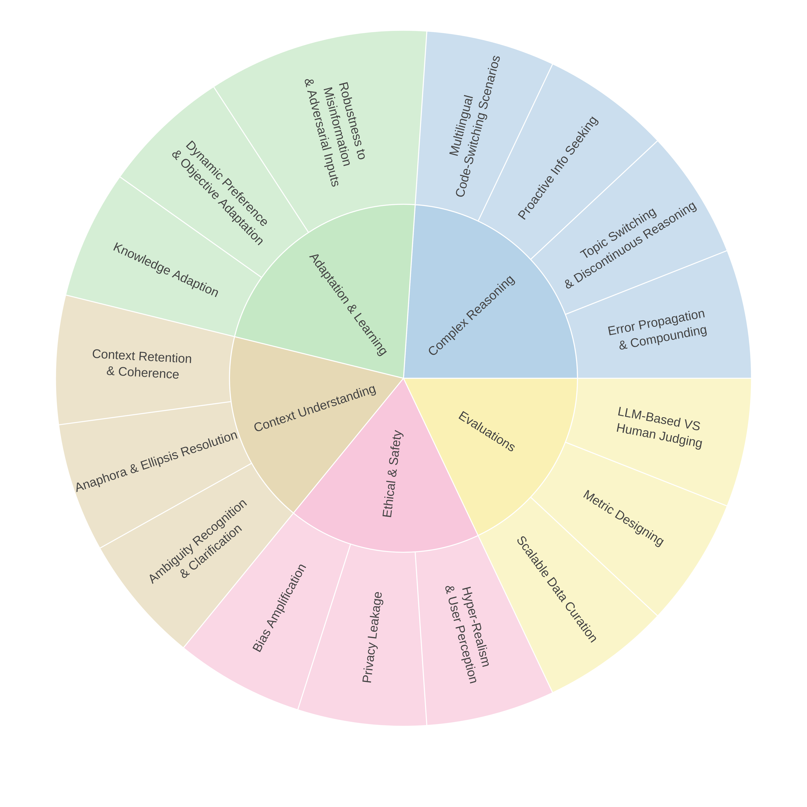

# Awesome-Multi-Turn-LLMs

A curated list of **Papers**, **Datasets** and **Code Repositories** for ***Multi-turn Large Language Models***. This repository compiles a majority of research works in the multi-turn LLM field, though it may not be fully exhaustive.

⭐⭐⭐Our detailed thoughts and review of multi-turn LLMs, including task types, common improvements, and open challenges, are presented in this survey:[**A Survey on Evaluation and Enhancement of Large Language Models Multi-turn Interactions**](https://arxiv.xxx).
> If you notice any missing research works or spot inaccuracies, feel free to reach out or open an issue!

## Table of Contents
- [Awesome-Multi-Turn-LLMs](#awesome-multi-turn-llms)
  - [Table of Contents](#table-of-contents)
  - [Keywords Convention](#keywords-convention)
  - [Multi-Turn LLM Tasks](#multi-turn-llm-tasks)
    - [Instruction Following Tasks](#instruction-following-tasks)
      - [Instruction Following in General (Mixed)](#instruction-following-in-general-mixed)
      - [Instruction Following in Math](#instruction-following-in-math)
      - [Instruction Following in Coding](#instruction-following-in-coding)
    - [Conversational Engagement Tasks](#conversational-engagement-tasks)
      - [Conversational Engagement in Roleplay](#conversational-engagement-in-roleplay)
      - [Conversational Engagement in Healthcare](#conversational-engagement-in-healthcare)
      - [Conversational Engagement in Education](#conversational-engagement-in-education)
      - [Conversational Engagement in Jailbreak](#conversational-engagement-in-jailbreak)
  - [Open Challenges](#Open-Challenges)

### Keywords Convention

 New dataset created in the work.

 Benchmark proposed in the work.

 SFT used in the work.

 Reinforcement Learning used in the work.

 Other improvement method(s) used in the work.

## Multi-Turn LLM Tasks

### Instruction Following Tasks

#### Instruction Following in General (Mixed)  (Total: 12)

- Judging LLM-as-a-Judge with MT-Bench and Chatbot Arena [[NeurIPS 2023](https://arxiv.org/abs/2306.05685)] [[GitHub](https://github.com/lm-sys/fastchat)]     
- (MT-Bench++) Parrot: Enhancing Multi-Turn Instruction Following for Large Language Models [[ACL 2024](https://aclanthology.org/2024.acl-long.525/)] [[Hugging Face](https://huggingface.co/datasets/anon8231489123/ShareGPT_Vicuna_unfiltered)]  
- MT-Eval: A Multi-Turn Capabilities Evaluation Benchmark for Large Language Models [[EMNLP 2024](https://aclanthology.org/2024.emnlp-main.1124/)] [[GitHub](https://github.com/KwanWaiChung/MT-Eval)]  
- MT-Bench-101: A Fine-Grained Benchmark for Evaluating Large Language Models in Multi-Turn Dialogues [[ACL 2024](https://aclanthology.org/2024.acl-long.401/)] [[GitHub](https://github.com/mtbench101/mt-bench-101)]  
                  

- M2Lingual: Enhancing Multilingual, Multi-Turn Instruction Alignment in Large Language Models [[arXiv](https://arxiv.org/abs/2406.16783)] [[Hugging Face](https://huggingface.co/datasets/ServiceNow-AI/M2Lingual)]  
- FB-Bench: A Fine-Grained Multi-Task Benchmark for Evaluating LLMs' Responsiveness to Human Feedback [[arXiv](https://www.arxiv.org/abs/2410.09412)] [[GitHub](https://github.com/PKU-Baichuan-MLSystemLab/FB-Bench)]   
- Multi-IF: Benchmarking LLMs on Multi-Turn and Multilingual Instructions Following [[arXiv](https://arxiv.org/abs/2410.15553)] [[GitHub](https://github.com/facebookresearch/Multi-IF)] [[Hugging Face](https://huggingface.co/datasets/facebook/Multi-IF)]  
- FairMT-Bench: Benchmarking Fairness for Multi-turn Dialogue in Conversational LLMs [[ICLR 2025](https://openreview.net/forum?id=RSGoXnS9GH)] [[GitHub](https://github.com/FanZT6/FairMT-bench)]  
- AQA-Bench: An Interactive Benchmark for Evaluating LLMs' Sequential Reasoning Ability
 [[arXiv](https://arxiv.org/abs/2402.09404)] [[GitHub](https://github.com/UCSC-VLAA/AQA-Bench)] 
- MINT: Evaluating LLMs in Multi-turn Interaction with Tools and Language Feedback [[ICLR 2024](https://arxiv.org/abs/2309.10691)] [[GitHub](https://github.com/xingyaoww/mint-bench)]    
- WILT: A Multi-Turn, Memorization-Robust Inductive Logic Benchmark for LLMs [[arXiv](https://arxiv.org/abs/2410.10998)] [[GitHub](https://github.com/riotgames/wilt)] 
- Firm or Fickle? Evaluating Large Language Models Consistency in Sequential Interactions [[arXiv](https://arxiv.org/abs/2503.22353)]

#### Instruction Following in Math (Total: 5)
- MathChat: Converse to Tackle Challenging Math Problems with LLM Agents [[ICLR 2024 Workshop on LLM Agents](https://openreview.net/pdf/96ec2baf0844fd84504bb79f9230483b1a62f517.pdf)] 
- Building Math Agents with Multi-Turn Iterative Preference Learning [[arXiv](https://arxiv.org/pdf/2409.02392)] 
- MathChat: Benchmarking Mathematical Reasoning and Instruction Following in Multi-Turn Interactions [[arXiv](https://arxiv.org/abs/2405.19444)][[GitHub](https://github.com/Zhenwen-NLP/MathChat)]  
- MathDial: A Dialogue Tutoring Dataset with Rich Pedagogical Properties Grounded in Math Reasoning Problems [[EMNLP 2023](https://aclanthology.org/2023.findings-emnlp.372/)] [[GitHub](https://github.com/eth-nlped/mathdial)] [[Hugging Face](https://huggingface.co/datasets/eth-nlped/mathdial)]  
- MathTutorBench: A Benchmark for Measuring Open-ended Pedagogical Capabilities of LLM Tutors [[arXiv](https://arxiv.org/pdf/2502.18940)] [[GitHub](https://github.com/eth-lre/mathtutorbench)]   

#### Instruction Following in Coding (Total: 0)
- Debug like a Human: A Large Language Model Debugger via Verifying Runtime Execution Step by Step [[ACL 2024](https://aclanthology.org/2024.findings-acl.49/)][[GitHub](https://github.com/FloridSleeves/LLMDebugger)] 
- Steering Large Language Models between Code Execution and Textual Reasoning [[ICLR 2025](https://openreview.net/forum?id=5X5Z7Ffrjb)][[GitHub](https://yongchao98.github.io/CodeSteer/)] [[HuggingFace](https://huggingface.co/yongchao98/CodeSteer-v1)] 

- From Code to Correctness: Closing the Last Mile of Code Generation with Hierarchical Debugging[[arXiv](https://arxiv.org/abs/2410.01215)][[GitHub](https://github.com/YerbaPage/MGDebugger)]
- InterCode: Standardizing and Benchmarking Interactive Coding with Execution Feedback [[NeurIPS 2023 Dataset and Benchmark] (https://proceedings.neurips.cc/paper_files/paper/2023/file/4b175d846fb008d540d233c188379ff9-Paper-Datasets_and_Benchmarks.pdf)][[GitHub](https://intercode-benchmark.github.io/)] 
- What Makes Large Language Models Reason in (Multi-Turn) Code Generation?

### Conversational Engagement Tasks 

#### Conversational Engagement in Roleplay (Total: 24)

- PersonaLLM: Investigating the Ability of Large Language Models to Express Personality Traits [[ACL 2024](https://aclanthology.org/2024.findings-naacl.229.pdf)] [[GitHub](https://github.com/hjian42/PersonaLLM)]
- CharacterChat: Learning towards Conversational AI with Personalized Social Support [[arXiv](https://arxiv.org/abs/2308.10278)]  [[GitHub](https://github.com/morecry/CharacterChat)] 
- Better Zero-Shot Reasoning with Role-Play Prompting [[ACL 2024](https://aclanthology.org/2024.naacl-long.228.pdf)] [[GitHub](https://github.com/NKU-HLT/Role-Play-Prompting)
- PIPPA: A Partially Synthetic Conversational Dataset [[arXiv](https://arxiv.org/abs/2308.05884)] [[Hugging Face](https://huggingface.co/datasets/PygmalionAI/PIPPA)] 
- Enhancing Chat Language Models by Scaling High-quality Instructional Conversations [[EMNLP 2023](https://aclanthology.org/2023.emnlp-main.183.pdf)] [[GitHub](https://github.com/thunlp/UltraChat)]     
- PRODIGy: a PROfile-based DIalogue Generation dataset [[ACL 2024](https://aclanthology.org/2024.findings-naacl.222.pdf)] [[GitHub](https://github.com/LanD-FBK/prodigy-dataset)]  
- ChatHaruhi: Reviving Anime Character in Reality via Large Language Model [[arXiv](https://arxiv.org/abs/2308.09597)] [[GitHub](https://github.com/LC1332/Chat-Haruhi-Suzumiya)]   
- CharacterGLM: Customizing Chinese Conversational AI Characters with Large Language Models [[EMNLP 2024](https://aclanthology.org/2024.emnlp-industry.107.pdf)] [[GitHub](https://github.com/thu-coai/CharacterGLM-6B)]  
- RoleCraft-GLM: Advancing Personalized Role-Playing in Large Language Models [[ACL 2024](https://aclanthology.org/2024.personalize-1.1.pdf)]  
- Large Language Models are Superpositions of All Characters: Attaining Arbitrary Role-play via Self-Alignment [[ACL 2024](https://aclanthology.org/2024.acl-long.423.pdf)] [[GitHub](https://github.com/OFA-Sys/Ditto)]    
- Character-LLM: A Trainable Agent for Role-Playing [[EMNLP 2023](https://aclanthology.org/2023.emnlp-main.814v2.pdf)] [[GitHub](https://github.com/choosewhatulike/trainable-agents)]  
- PersonaPKT: Building Personalized Dialogue Agents via Parameter-efficient Knowledge Transfer [[ACL 2023](https://aclanthology.org/2023.sustainlp-1.21.pdf)]  
- LLMs + Persona-Plug = Personalized LLMs [[arXiv](https://arxiv.org/abs/2409.11901)] [[Hugging Face](https://huggingface.co/papers/2409.11901)] 
- Neeko: Leveraging dynamic lora for efficient multi-character role-playing agent [[EMNLP 2024](https://aclanthology.org/2024.emnlp-main.697.pdf)] [[GitHub](https://github.com/weiyifan1023/Neeko)]  
-  Instruct Once, Chat Consistently in Multiple Rounds: An Efficient Tuning Framework for Dialogue [[ACL 2024](https://aclanthology.org/2024.acl-long.219.pdf)] [[GitHub](https://github.com/iwangjian/Midi-Tuning)]  
-  Building Persona Consistent Dialogue Agents with Offline Reinforcement Learning [[EMNLP 2023](https://aclanthology.org/2023.emnlp-main.110.pdf)]     
-  Beyond Retrieval: Embracing Compressive Memory in Real-World Long-Term Conversations [[arXiv](https://arxiv.org/abs/2402.11975)] [[GitHub](https://github.com/nuochenpku/COMEDY)]
                      
- LaMP: When Large Language Models Meet Personalization [[ACL 2024](https://aclanthology.org/2024.acl-long.399.pdf)] [[GitHub](https://lamp-benchmark.github.io/)]  
- CharacterEval: A Chinese Benchmark for Role-Playing Conversational Agent Evaluation [[ACL 2024](https://aclanthology.org/2024.acl-long.638.pdf)] [[GitHub](https://github.com/morecry/CharacterEval)]  
                   
- RoleEval: A Bilingual Role Evaluation Benchmark for Large Language Models [[arXiv](https://arxiv.org/abs/2312.16132)] [[GitHub](https://github.com/Magnetic2014/RoleEval)]   
                   
- TimeChara: Evaluating Point-in-Time Character Hallucination of Role-Playing Large Language Models  [[ACL 2024](https://aclanthology.org/2024.findings-acl.197/)] [[GitHub](https://github.com/ahnjaewoo/timechara)]  
                   
- InCharacter: Evaluating Personality Fidelity in Role-Playing Agents through Psychological Interviews [[ACL 2024](https://aclanthology.org/2024.acl-long.102/)] [[GitHub](https://incharacter.github.io/)] 
                   
- RoleInteract: Evaluating the Social Interaction of Role-Playing Agents [[arXiv](https://arxiv.org/abs/2403.13679)] [[GitHub](https://github.com/X-PLUG/RoleInteract)]  
                   
- Evaluating Character Understanding of Large Language Models via Character Profiling from Fictional Work [[EMNLP 2024](https://aclanthology.org/2024.emnlp-main.456/)] [[GitHub](https://github.com/Joanna0123/character_profiling)]  
                    

#### Conversational Engagement in Healthcare (Total: 19)
- Data Set and Benchmark (MedGPTEval) to Evaluate Responses From Large Language Models in Medicine: Evaluation Development and Validation [[JMIR Med Inform](https://medinform.jmir.org/2024/1/e57674)]
                    
- Clinical Camel: An Open-Source Expert-Level Medical Language Model with Dialogue-Based Knowledge Encoding [[CoRR 2023](https://arxiv.org/pdf/2305.12031v2)]
                    
- HuatuoGPT, towards Taming Language Model  to Be a Doctor [[arXiv](https://arxiv.org/pdf/2305.15075)] [[GitHub](https://github.com/FreedomIntelligence/HuatuoGPT)]
                    
- DISC-MedLLM: Bridging General Large Language Models and Real-World Medical Consultation [[arXiv](https://arxiv.org/pdf/2308.14346)] [[GitHub](https://github.com/FudanDISC/DISC-MedLLM)]
                     
- Zhongjing: Enhancing the Chinese Medical Capabilities of Large Language Model through Expert Feedback and Real-world Multi-turn Dialogue [[arXiv](https://arxiv.org/pdf/2308.03549)] [[GitHub](https://github.com/SupritYoung/Zhongjing)]
                     
- An Automatic Evaluation Framework for Multi-turn Medical Consultations Capabilities of Large Language Models [[arXiv](https://arxiv.org/abs/2309.02077)
                    
- BianQue: Balancing the Questioning and Suggestion Ability of Health LLMs with Multi-turn Health Conversations Polished by ChatGPT [[arXiv](https://arxiv.org/abs/2310.15896)] [[GitHub](https://github.com/scutcyr/BianQue)]
                    
- Qilin-Med: Multi-stage Knowledge Injection Advanced Medical Large Language Model [[arXiv](https://arxiv.org/abs/2310.09089)]
                      
- Towards Conversational Diagnostic AI [[arXiv](https://arxiv.org/abs/2401.05654)]
                     
- CPsyCoun: A Report-based Multi-turn Dialogue Reconstruction and Evaluation Framework for Chinese Psychological Counseling [[arXiv](https://arxiv.org/abs/2405.16433)] [[GitHub](https://github.com/CAS-SIAT-XinHai/CPsyCoun)]
                     
- Automatic Interactive Evaluation for Large Language Models with State Aware Patient Simulator [[arXiv](https://arxiv.org/abs/2403.08495)] [[GitHub](https://github.com/bluezeros/automatic_interactive_evaluation)]
                   
- HuatuoGPT-II, One-stage Training for Medical Adaption of LLMs [[COLM 2024](https://arxiv.org/abs/2311.09774)] [[GitHub](https://github.com/FreedomIntelligence/HuatuoGPT-II)]
                    
- Aqulia-Med LLM: Pioneering Full-Process Open-Source Medical Language Models [[arXiv](https://arxiv.org/abs/2406.12182)] [[Hugging Face](https://huggingface.co/BAAI/AquilaMed-RL)]
                     
- T-Agent: A Term-Aware Agent for Medical Dialogue Generation [[IJCNN 2024](https://ieeexplore.ieee.org/document/10650649/)]
                   
- MediQ: Question-Asking LLMs and a Benchmark for Reliable Interactive Clinical Reasoning [[NeurIPS 2024](https://proceedings.neurips.cc/paper_files/paper/2024/hash/32b80425554e081204e5988ab1c97e9a-Abstract-Conference.html)] [[Hugging Face](https://huggingface.co/datasets/stellalisy/mediQ)] [[GitHub](https://github.com/stellalisy/mediQ)]
                  
- BiMediX: Bilingual Medical Mixture of Experts LLM [[arXiv](https://arxiv.org/abs/2402.13253)] [[GitHub](https://github.com/mbzuai-oryx/BiMediX)]
                   
- PsycoLLM: Enhancing LLM for Psychological Understanding and Evaluation [[IEEE Trans. Comput. Soc.](https://ieeexplore.ieee.org/document/10772313)] [[GitHub](https://github.com/MACLAB-HFUT/PsycoLLM)]
                   
- Interactive Evaluation for Medical LLMs via Task-oriented Dialogue System [[COLING 2025](https://aclanthology.org/2025.coling-main.325/)]
                  
- Ask Patients with Patience: Enabling LLMs for Human-Centric Medical Dialogue with Grounded Reasoning [[arXiv](https://arxiv.org/abs/2502.07143)] [[GitHub](https://github.com/SuperMedIntel/AskPatients)]
                   
- An Automatic Evaluation Framework for Multi-turn Medical Consultations Capabilities of Large Language Models [[arXiv](https://arxiv.org/abs/2309.02077)]
                  

#### Conversational Engagement in Education (Total: 0)
- SocraticLM: Exploring Socratic Personalized Teaching with Large Language Models [[NeurIPS 2024](https://openreview.net/pdf?id=qkoZgJhxsA)] [Code](https://github.com/Ljyustc/SocraticLM)]   
- Instruct, Not Assist: LLM-based Multi-Turn Planning and Hierarchical Questioning for Socratic Code Debugging  [[EMNLP 2024](https://aclanthology.org/2024.findings-emnlp.553.pdf)]  [[github](https://github.com/agarwalishika/TreeInstruct)]
- Towards the Pedagogical Steering of Large Language Models for Tutoring: A Case Study with Modeling Productive Failure [[arXiv](https://arxiv.org/abs/2410.03781)]  [[github](https://github.com/RomainPuech/StratL-Pedagogical-Steering-of-LLMs-for-Tutoring)]
- One Size doesn't Fit All: A Personalized Conversational Tutoring Agent for Mathematics Instruction [[arXiv](https://arxiv.org/abs/2502.12633)]
- A Step Towards Adaptive Online Learning: Exploring the Role of GPT as Virtual Teaching Assistants in Online Education

#### Conversational Engagement in Jailbreak (Total: 0)

## Open Challenges

In our survey paper on multi-turn interactions and tasks for large language models (LLMs), we categorize a wide range of tasks, including instruction-following scenarios and more complex conversational engagement tasks. To complement this, we also include an illustration highlighting key open challenges in this domain. If you're interested in the detailed improvement methods and a deeper discussion of the open challenges, please refer to our [Full Paper](https://arxiv.xxx).

